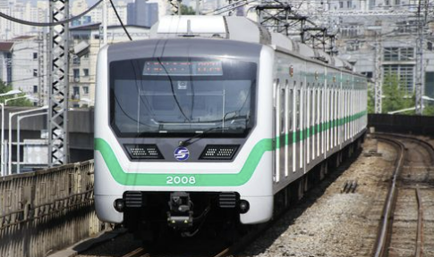

## Seoul Subway Path Optimization   서울지하철 최단경로 찾기
## Contributors 팀원목록:
- ### Louis Sungwoo Cho 조성우 

## Project Description 프로젝트 설명:
This project analyzes path optimization in Seoul's subway network using various shortest path algorithms in a graph network. Seoul Metropolitan Subway Network is extremely dense and many operators such as Seoul Metro, Seoul Metro 9, KORAIL, Shinbundang Line, Uijeongbu Light Rail, Everland Light Rail, and more. With more lines to be opened, the passenger ridership is expected to increase. Finding the shortest path is crucial in a dense network like the Seoul Metropolitan Subway Network because passengers need to go from one place to another as quickly as possible. Path optimization in public transportation systems is very crucial. 

## Commands:
First clone the repository:
    git clone "https://github.com/lotlouischoitslab/Seoul_Subway_Optimal_Path_Finder"
    
Then on your VSCode terminal, go to the Graphs folder:  
    cd Graphs
    
Then run the main function by typing this command:
    python main.py
